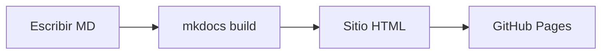

# 📝 Plantilla para Documentar Proyectos con MkDocs Material

¿Cansado de documentar proyectos de forma desordenada? En este post te presento una **plantilla estándar** que uso para todos mis proyectos y te explico por qué **MkDocs Material** es la herramienta perfecta para documentación técnica.

<!-- more -->

## ¿Por qué usar MkDocs Material?

!!! success "Ventajas principales"
    - **Markdown puro**: Escribes en texto plano, se genera HTML profesional.
    - **Despliegue automático**: Con GitHub Pages, cada push actualiza tu sitio.
    - **Tema moderno**: Sin configurar CSS, tienes dark mode, búsqueda y responsive.
    - **Extensiones potentes**: Diagramas Mermaid, tabs, admonitions, código con resaltado...

## Estructura de la Plantilla

Mi plantilla de proyecto incluye estas secciones:

| Sección | Propósito |
| :--- | :--- |
| **Información del Proyecto** | Metadatos: nombre, fecha, estado, tecnologías |
| **Descripción y Objetivos** | Qué hace el proyecto y qué queremos lograr |
| **Instalación** | Pasos para configurar el entorno (Windows/Linux) |
| **Uso** | Ejemplos de código y casos de uso |
| **Estructura del Proyecto** | Árbol de directorios |
| **Características Clave** | Funcionalidades importantes con diagramas |
| **Problemas Resueltos** | Debugging documentado para referencia futura |
| **Testing** | Tests unitarios y cobertura |

## Ejemplo: Tabla de Información

```markdown
| Campo | Valor |
|-------|-------|
| **Nombre** | Mi Proyecto |
| **Estado** | 🟢 Completado |
| **Tecnologías** | Python, Docker |
```

Se renderiza así:

| Campo | Valor |
|-------|-------|
| **Nombre** | Mi Proyecto |
| **Estado** | 🟢 Completado |
| **Tecnologías** | Python, Docker |

## Bloques Especiales (Admonitions)

MkDocs Material permite usar bloques de información muy visuales:

=== "Código"
    ```markdown
    !!! tip "Consejo"
        Usa entornos virtuales siempre.
    
    !!! warning "Atención"
        No subas archivos sensibles a Git.
    ```

=== "Resultado"
    !!! tip "Consejo"
        Usa entornos virtuales siempre.
    
    !!! warning "Atención"
        No subas archivos sensibles a Git.

## Diagramas con Mermaid

Puedes incluir diagramas de flujo directamente en Markdown:



## Tabs para Multiplataforma

Documentar instalación para varios sistemas:

=== "Windows"
    ```bash
    python -m venv venv
    venv\Scripts\activate
    ```

=== "Linux/Mac"
    ```bash
    python3 -m venv venv
    source venv/bin/activate
    ```

## ¿Cómo empezar?

1. **Accede a la plantilla** desde el enlace de abajo
2. **Renombra el archivo** con el nombre de tu proyecto
3. **Rellena las secciones** eliminando lo que no necesites
4. **Haz commit y push** para tener la documentación en tu repositorio con el proyecto mkdocs.

[📥 Descargar Plantilla de Proyecto](../../recursos/plantilla-proyecto.md){ .md-button }


!!! abstract "Conclusión"
    Una buena documentación es tan importante como el código. Con MkDocs Material y esta plantilla, documentar proyectos se convierte en algo **rápido, visual y profesional**.

!!! info "¿Aún no tienes MkDocs configurado?"
    Si todavía no has creado tu entorno de documentación, consulta mi tutorial completo: [Creando mi Portfolio con Material for MkDocs](2026-01-16-creando-mi-portfolio.md). Incluye configuración de entorno virtual, `.gitignore` y automatización con GitHub Actions.

---

*¿Tienes sugerencias para mejorar la plantilla? ¡Déjame un comentario!*
