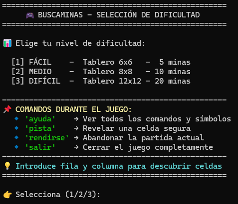
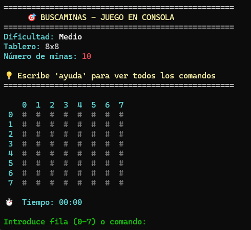
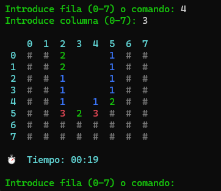
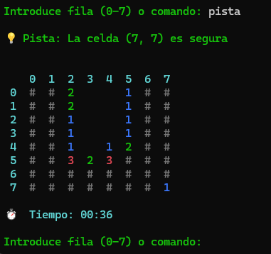
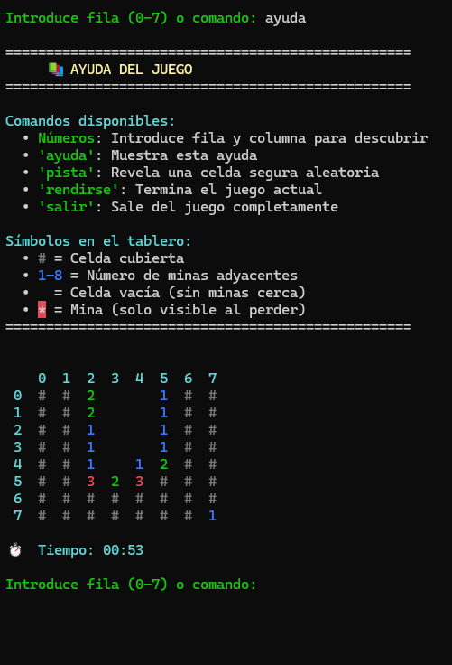
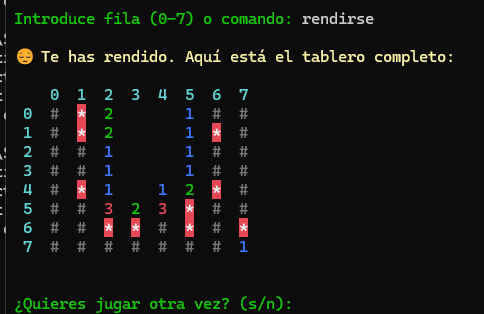
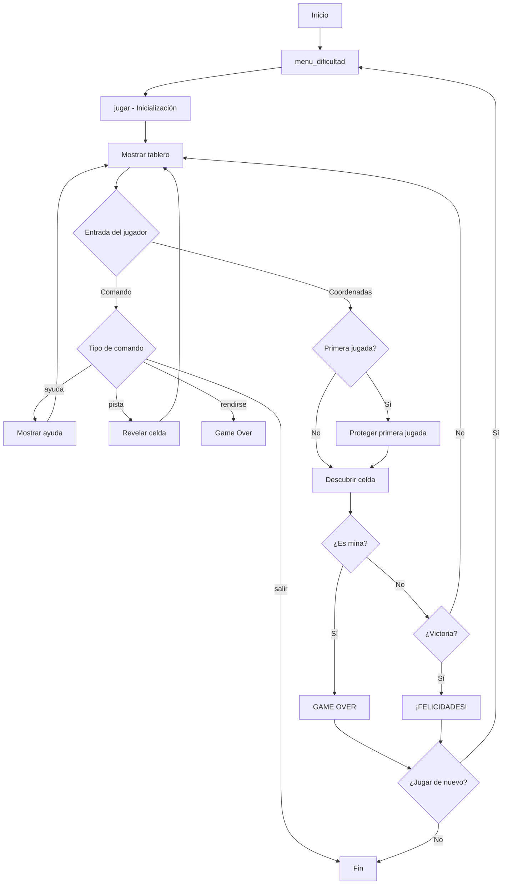

---
tags:
  - Python
  - Juegos
  - Tutorial
  - Consola
---

# :material-school: Documentación - Buscaminas en Python

!!! abstract "Objetivo del Documento"
    Este documento explica detalladamente el código del juego **BuscaMinas** desarrollado en Python para consola. Está diseñado para entender cada parte del código y poder entender el código.

---

## :material-gamepad-variant: Descripción General

El **BuscaMinas** es un juego de lógica donde el jugador debe descubrir todas las celdas del tablero que **no contienen minas**.

!!! success "Condiciones de Victoria / Derrota"
    *   **GANAS**: Descubres todas las celdas seguras (sin minas).
    *   **PIERDES**: Descubres una celda con mina.

### Características implementadas

| Característica | Descripción |
| :--- | :--- |
| :material-palette: **Colores ANSI** | Mejora visual en consola para una experiencia moderna. |
| :material-timer: **Cronómetro** | Mide el tiempo de juego en tiempo real. |
| :material-trophy: **Puntuaciones** | Guarda los mejores tiempos en un archivo JSON. |
| :material-shield-check: **Seguridad** | "Primera jugada protegida": nunca pisas mina al empezar. |
| :material-lightbulb: **Pistas** | Sistema de ayuda que revela celdas seguras. |
| :material-chart-bar: **Dificultad** | 3 niveles ajustables (Fácil, Medio, Difícil). |

<figure markdown="span">
  { width="500" loading="lazy" }
  <figcaption>Menú de selección de dificultad con 3 niveles</figcaption>
</figure>

---

## :material-file-tree: Estructura del Programa

El código está dividido en **12 partes** lógicas:

??? info "Ver estructura detallada"
    ```
    BuscaMinas.py
    │
    ├── PARTE 0: Importación de librerías
    ├── PARTE 1: Configuración y Colores
    ├── PARTE 2: crear_tablero()
    ├── PARTE 3: colocar_minas()
    ├── PARTE 4: calcular_numeros()
    ├── PARTE 5: crear_tablero_visible()
    ├── PARTE 6: mostrar_tablero()
    ├── PARTE 7: descubrir_celda()
    ├── PARTE 8: verificar_victoria()
    ├── PARTE 9: Funciones auxiliares (pistas, records)
    ├── PARTE 10: menu_dificultad()
    ├── PARTE 11: jugar() - Función principal
    └── PARTE 12: Punto de entrada (main)
    ```

---

## :package: Importación de Librerías

```python title="PARTE 0: Imports"
import random    # Para generar posiciones aleatorias de minas
import time      # Para el cronómetro del juego
import json      # Para guardar/cargar puntuaciones
import os        # Para verificar si existe el archivo de puntuaciones
```

| Librería | Uso específico |
| :--- | :--- |
| `random` | `random.randint()` genera posiciones aleatorias para minas |
| `time` | `time.time()` obtiene el tiempo actual para calcular duración |
| `json` | `json.load()` y `json.dump()` para guardar récords en archivo |
| `os` | `os.path.exists()` verifica si existe archivo de puntuaciones |

---

## :material-cog: Configuración y Colores

### Variables Globales

```python title="PARTE 1: Configuración"
FILAS = 8          # Se modifica según dificultad
COLUMNAS = 8       # Se modifica según dificultad  
NUM_MINAS = 10     # Se modifica según dificultad
```

!!! warning "Variables Globales"
    Estas variables son **globales** y se modifican en la función `jugar()` según la dificultad elegida.

### Diccionario de Dificultades

```python
DIFICULTADES = {
    '1': {'nombre': 'Fácil', 'filas': 6, 'columnas': 6, 'minas': 5},
    '2': {'nombre': 'Medio', 'filas': 8, 'columnas': 8, 'minas': 10},
    '3': {'nombre': 'Difícil', 'filas': 12, 'columnas': 12, 'minas': 20}
}
```

### Clase Colores (ANSI)

```python
class Colores:
    RESET = '\033[0m'      # Restablece colores
    ROJO = '\033[91m'      # Para minas y errores
    VERDE = '\033[92m'     # Para mensajes de éxito
    AZUL = '\033[94m'      # Para el número 1
    # ... más colores
```

!!! note "¿Qué son los códigos ANSI?"
    Son secuencias de escape (`\033[`) que permiten cambiar colores en la terminal. El formato es `\033[CODIGOm`.

---

## :material-grid: Funciones del Tablero

### :material-table: PARTE 2: `crear_tablero()`

**Propósito**: Crea una matriz vacía que representa el tablero interno (con minas y números).

```python title="crear_tablero()"
def crear_tablero():
    tablero = []
    for i in range(FILAS):
        fila = []
        for j in range(COLUMNAS):
            fila.append(0)  # 0 = sin mina
        tablero.append(fila)
    return tablero
```

??? example "Explicación paso a paso"
    1. Crea una lista vacía `tablero`
    2. Por cada fila, crea una lista vacía `fila`
    3. Por cada columna, añade un `0` a la fila
    4. Añade la fila completa al tablero
    5. Retorna la matriz

    **Ejemplo de resultado (6x6)**:
    ```
    [[0, 0, 0, 0, 0, 0],
     [0, 0, 0, 0, 0, 0],
     [0, 0, 0, 0, 0, 0],
     [0, 0, 0, 0, 0, 0],
     [0, 0, 0, 0, 0, 0],
     [0, 0, 0, 0, 0, 0]]
    ```

---

### :bomb: PARTE 3: `colocar_minas()`

**Propósito**: Coloca las minas en posiciones aleatorias del tablero.

```python title="colocar_minas()"
def colocar_minas(tablero, num_minas):
    minas_colocadas = 0
    
    while minas_colocadas < num_minas:
        fila = random.randint(0, FILAS - 1)
        columna = random.randint(0, COLUMNAS - 1)
        
        if tablero[fila][columna] != -1:  # Si no hay mina
            tablero[fila][columna] = -1   # Coloca mina (-1)
            minas_colocadas += 1
```

**Representación de valores:**

| Valor | Significado | Icono |
| :---: | :--- | :---: |
| `-1` | **Mina** | :bomb: |
| `0` | Sin minas adyacentes | :white_square_button: |
| `1-8` | Número de minas adyacentes | :one: - :eight: |

---

### :material-calculator: PARTE 4: `calcular_numeros()`

**Propósito**: Calcula cuántas minas hay alrededor de cada celda.

```python title="calcular_numeros()"
def calcular_numeros(tablero):
    for fila in range(FILAS):
        for columna in range(COLUMNAS):
            if tablero[fila][columna] != -1:  # Si NO es mina
                minas_adyacentes = 0
                
                # Revisa las 8 direcciones
                for i in range(-1, 2):      # -1, 0, 1
                    for j in range(-1, 2):  # -1, 0, 1
                        nueva_fila = fila + i
                        nueva_columna = columna + j
                        
                        # Verifica límites
                        if (0 <= nueva_fila < FILAS and 
                            0 <= nueva_columna < COLUMNAS):
                            if tablero[nueva_fila][nueva_columna] == -1:
                                minas_adyacentes += 1
                
                tablero[fila][columna] = minas_adyacentes
```

??? tip "Visualización de las 8 direcciones"
    ```
      [-1,-1]  [-1, 0]  [-1,+1]
      [ 0,-1]  [CELDA]  [ 0,+1]
      [+1,-1]  [+1, 0]  [+1,+1]
    ```

---

### :material-eye: PARTE 5: `crear_tablero_visible()`

**Propósito**: Crea el tablero que ve el jugador (todo cubierto con `#`).

```python title="crear_tablero_visible()"
def crear_tablero_visible():
    tablero_visible = []
    for i in range(FILAS):
        fila = []
        for j in range(COLUMNAS):
            fila.append('#')  # '#' = celda cubierta
        tablero_visible.append(fila)
    return tablero_visible
```

**Diferencia entre tableros:**

| Tablero | Contenido | Ejemplo |
| :--- | :--- | :--- |
| **`tablero` (interno)** | Minas (-1) y números | `[[-1, 1, 0], [1, 1, 0]]` |
| **`tablero_visible`** | Lo que ve el jugador | `[['#', '#', '#'], ['#', '#', '#']]` |

---

### :material-monitor: PARTE 6: `mostrar_tablero()`

**Propósito**: Imprime el tablero con formato legible y colores.

```python title="mostrar_tablero()"
def mostrar_tablero(tablero_visible):
    # Muestra encabezado con números de columna
    print("\n" + Colores.CIAN + "   ", end="")
    for col in range(COLUMNAS):
        print(f"{Colores.BOLD}{col:2d}{Colores.RESET}{Colores.CIAN} ", end="")
    print(Colores.RESET)
    
    # Muestra cada fila
    for i, fila in enumerate(tablero_visible):
        print(f"{Colores.CIAN}{Colores.BOLD}{i:2d}{Colores.RESET} ", end="")
        for celda in fila:
            # Aplica colores según el contenido
            if celda == '#':
                # Gris para celdas cubiertas
                pass
            elif celda == '*':
                # Rojo para minas
                pass
            # ... más condiciones
```

??? example "Ejemplo de salida"
    ```
        0  1  2  3  4  5
     0  #  #  #  #  #  #
     1  #  1  2  #  #  #
     2  #     1  #  #  #
    ```

<figure markdown="span">
  { width="450" loading="lazy" }
  <figcaption>Ejemplo real del tablero con colores ANSI</figcaption>
</figure>

---

### :material-animation-play: PARTE 7: `descubrir_celda()` - IMPORTANTE

**Propósito**: Descubre una celda y, si tiene 0 minas adyacentes, descubre automáticamente las vecinas.

!!! danger "Algoritmo usado: Flood Fill iterativo"
    Usamos una **pila** en lugar de recursión para evitar errores de *Stack Overflow* en tableros grandes.

```python title="descubrir_celda()"
def descubrir_celda(tablero, tablero_visible, fila, columna):
    # Validaciones iniciales
    if fila < 0 or fila >= FILAS or columna < 0 or columna >= COLUMNAS:
        return True
    if tablero_visible[fila][columna] != '#':
        return True
    if tablero[fila][columna] == -1:
        return False  # ¡Es una mina!
    
    # Usa una PILA para procesar celdas
    pila = [(fila, columna)]
    
    while pila:
        f, c = pila.pop()
        
        # Validaciones
        if f < 0 or f >= FILAS or c < 0 or c >= COLUMNAS:
            continue
        if tablero_visible[f][c] != '#':
            continue
        
        valor = tablero[f][c]
        
        if valor == 0:
            tablero_visible[f][c] = ' '  # Celda vacía
            # Añade las 8 celdas adyacentes a la pila
            for i in range(-1, 2):
                for j in range(-1, 2):
                    if i != 0 or j != 0:
                        pila.append((f + i, c + j))
        else:
            tablero_visible[f][c] = str(valor)
    
    return True
```

<figure markdown="span">
  { width="400" loading="lazy" }
  <figcaption>Efecto Flood Fill: al descubrir una celda vacía, se expande automáticamente</figcaption>
</figure>

---

### :trophy: PARTE 8: `verificar_victoria()`

**Propósito**: Comprueba si el jugador ha ganado.

```python title="verificar_victoria()"
def verificar_victoria(tablero_visible):
    celdas_cubiertas = 0
    
    for fila in tablero_visible:
        for celda in fila:
            if celda == '#':
                celdas_cubiertas += 1
    
    # Gana si solo quedan cubiertas las celdas con minas
    return celdas_cubiertas == NUM_MINAS
```

!!! info "Lógica de victoria"
    - Total de celdas: `FILAS × COLUMNAS`
    - Celdas con minas: `NUM_MINAS`
    - Celdas seguras: `Total - NUM_MINAS`
    - **Victoria**: Cuando todas las celdas seguras están descubiertas → las únicas cubiertas (`#`) son las minas.

---

## :material-wrench: Funciones Auxiliares

### `proteger_primera_jugada()`

**Propósito**: Si la primera jugada es una mina, la mueve a otro lugar.

```python title="proteger_primera_jugada()"
def proteger_primera_jugada(tablero, fila, columna):
    if tablero[fila][columna] == -1:
        tablero[fila][columna] = 0  # Quita la mina
        
        # Busca nueva posición
        while True:
            nueva_fila = random.randint(0, FILAS - 1)
            nueva_columna = random.randint(0, COLUMNAS - 1)
            
            if (nueva_fila != fila or nueva_columna != columna) and \
               tablero[nueva_fila][nueva_columna] != -1:
                tablero[nueva_fila][nueva_columna] = -1
                break
        
        calcular_numeros(tablero)  # Recalcula números
```

---

### `cargar_puntuaciones()` y `guardar_puntuacion()`

**Propósito**: Gestión de récords usando JSON.

=== "Cargar"
    ```python
    def cargar_puntuaciones():
        if os.path.exists(ARCHIVO_PUNTUACIONES):
            with open(ARCHIVO_PUNTUACIONES, 'r', encoding='utf-8') as f:
                return json.load(f)
        return {}
    ```

=== "Guardar"
    ```python
    def guardar_puntuacion(nombre_dificultad, tiempo):
        puntuaciones = cargar_puntuaciones()
        tiempo_redondeado = round(tiempo, 2)
        
        if nombre_dificultad not in puntuaciones or \
           tiempo_redondeado < puntuaciones[nombre_dificultad]:
            puntuaciones[nombre_dificultad] = tiempo_redondeado
            with open(ARCHIVO_PUNTUACIONES, 'w', encoding='utf-8') as f:
                json.dump(puntuaciones, f, indent=4, ensure_ascii=False)
            return True  # Es récord
        return False
    ```

!!! tip "Buenas prácticas"
    Usamos `round(tiempo, 2)` para guardar tiempos legibles (ej: `12.56`) y `ensure_ascii=False` para que `Fácil` no se guarde como `F\u00e1cil`.

---

### `obtener_celda_segura()`

**Propósito**: Encuentra una celda sin mina que aún no se ha descubierto (para pistas).

```python title="obtener_celda_segura()"
def obtener_celda_segura(tablero, tablero_visible):
    celdas_seguras = []
    
    for fila in range(FILAS):
        for columna in range(COLUMNAS):
            if tablero_visible[fila][columna] == '#' and \
               tablero[fila][columna] != -1:
                celdas_seguras.append((fila, columna))
    
    if celdas_seguras:
        return random.choice(celdas_seguras)
    return None
```

<figure markdown="span">
  { width="450" loading="lazy" }
  <figcaption>El comando 'pista' revela una celda segura aleatoria</figcaption>
</figure>

---

## :material-play-circle: Flujo Principal del Juego

### PARTE 11: Función `jugar()`

Esta es la función más importante. Controla todo el flujo del juego:

```python title="jugar()"
def jugar(filas, columnas, num_minas, nombre_dificultad):
    # 1. Actualiza variables globales
    global FILAS, COLUMNAS, NUM_MINAS
    FILAS = filas
    COLUMNAS = columnas
    NUM_MINAS = num_minas
    
    # 2. INICIALIZACIÓN
    tablero = crear_tablero()
    colocar_minas(tablero, NUM_MINAS)
    calcular_numeros(tablero)
    tablero_visible = crear_tablero_visible()
    
    juego_activo = True
    primera_jugada = True
    tiempo_inicio = time.time()
    
    # 3. BUCLE PRINCIPAL
    while juego_activo:
        mostrar_tablero(tablero_visible)
        
        entrada = input("Introduce fila o comando: ")
        
        # 4. PROCESA COMANDOS
        if entrada == 'ayuda':
            mostrar_ayuda()
        elif entrada == 'pista':
            # Revela celda segura
            pass
        elif entrada == 'rendirse':
            # Muestra todas las minas
            pass
        elif entrada == 'salir':
            return
        
        # 5. PROCESA JUGADA
        fila = int(entrada)
        columna = int(input("Columna: "))
        
        # Protege primera jugada
        if primera_jugada:
            proteger_primera_jugada(tablero, fila, columna)
            primera_jugada = False
        
        # Descubre celda
        exito = descubrir_celda(tablero, tablero_visible, fila, columna)
        
        # 6. VERIFICA RESULTADO
        if not exito:
            print("💥 GAME OVER - Pisaste una mina")
            juego_activo = False
        elif verificar_victoria(tablero_visible):
            print("🎉 ¡FELICIDADES! Has ganado")
            juego_activo = False
```
<div class="grid" markdown>

<figure markdown="span">
  { width="350" loading="lazy" }
  <figcaption>Comando 'ayuda'</figcaption>
</figure>

<figure markdown="span">
  { width="350" loading="lazy" }
  <figcaption>Comando 'rendirse'</figcaption>
</figure>

</div>
---

### PARTE 12: Punto de Entrada

```python title="main"
if __name__ == "__main__":
    configuracion = menu_dificultad()
    jugar(configuracion['filas'], 
          configuracion['columnas'], 
          configuracion['minas'], 
          configuracion['nombre'])
```

!!! question "¿Qué significa `if __name__ == \"__main__\"`?"
    Este código solo se ejecuta cuando corres el archivo directamente (`python BuscaMinas.py`), no cuando lo importas como módulo.

---

## :material-chart-bubble: Diagrama de Flujo



---

## :material-book-open-variant: Conceptos Clave

### 1. Estructuras de Datos

| Estructura | Uso |
| :--- | :--- |
| **Lista de listas (Matriz)** | Tablero de juego |
| **Diccionario** | Configuraciones de dificultad, colores |
| **Tupla** | Coordenadas (fila, columna) |
| **Pila (lista como stack)** | Flood Fill iterativo |

### 2. Conceptos de Programación

| Concepto | Dónde se usa |
| :--- | :--- |
| **Variables globales** | `FILAS`, `COLUMNAS`, `NUM_MINAS` |
| **Bucles anidados** | Recorrer matriz, calcular adyacentes |
| **Algoritmo Flood Fill** | `descubrir_celda()` |
| **Manejo de archivos** | Guardar/cargar JSON |
| **Clases** | `class Colores` |
| **Manejo de excepciones** | `try/except` en `jugar()` |

### 3. Algoritmo Flood Fill Explicado

!!! example "Pasos del algoritmo"
    1. Añade la celda inicial a la pila
    2. Mientras la pila no esté vacía:
        - Saca una celda de la pila
        - Si ya está descubierta o fuera de límites, continúa
        - Si tiene valor 0:
            - Márcala como descubierta (' ')
            - Añade las 8 celdas adyacentes a la pila
        - Si tiene valor 1-8:
            - Márcala con ese número (no propaga)

---

## :material-help-circle: Preguntas Frecuentes

??? question "¿Por qué usamos `-1` para las minas?"
    Porque las celdas normales tienen valores de `0` a `8` (minas adyacentes). Usar `-1` evita confusiones y simplifica las comprobaciones lógicas `if valor == -1`.

??? question "¿Por qué hay dos tableros?"
    El `tablero` interno guarda la "verdad" del juego (minas y números). El `tablero_visible` es lo que ve el jugador y va actualizándose según descubre celdas.

??? question "¿Por qué usar pila en lugar de recursión?"
    La recursión tiene un límite de profundidad en Python (~1000 llamadas). En un tablero grande, el Flood Fill podría superar ese límite y causar un error.

??? question "¿Cómo funciona la protección de primera jugada?"
    Si el jugador selecciona una celda con mina en su primer turno, esa mina se mueve a otra posición aleatoria y se recalculan todos los números.

??? question "¿Qué pasa si borras el archivo JSON?"
    El programa utiliza `os.path.exists()` para comprobarlo. Si no existe, simplemente crea uno nuevo sin dar error.

---

## :material-check-all: Resumen Final

| Componente | Función Principal |
| :--- | :--- |
| Tablero interno | Almacena minas y números |
| Tablero visible | Muestra estado al jugador |
| Flood Fill | Descubre celdas automáticamente |
| Sistema de puntuaciones | Guarda mejores tiempos en JSON |
| Colores ANSI | Mejora visual |
| Comandos especiales | ayuda, pista, rendirse, salir |

---

*Documentación finalizada - Buscaminas en Python*