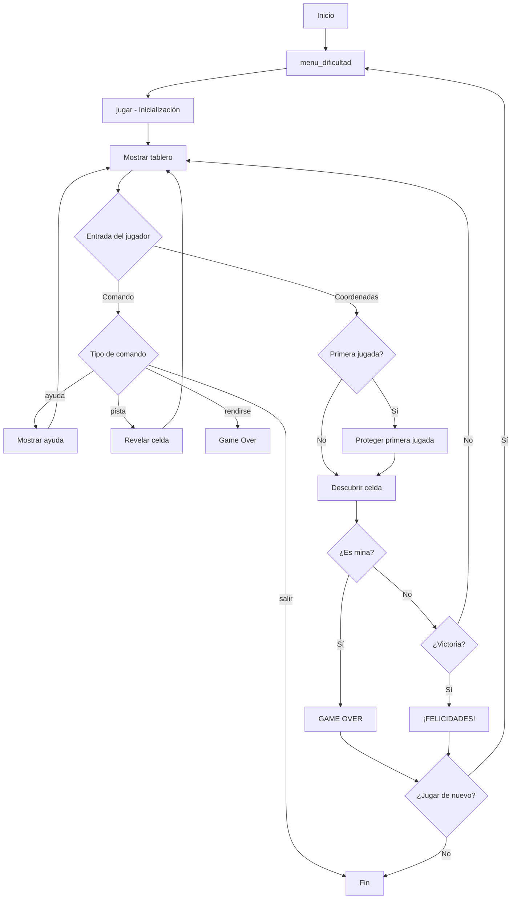

# 📚 PLAN DE ESTUDIO - BUSCAMINAS EN PYTHON

## 🎯 Objetivo del Documento
Este documento explica detalladamente el código del juego **BuscaMinas** desarrollado en Python para consola. Está diseñado para entender cada parte del código y poder explicarla a un tutor.

---

## 📋 ÍNDICE
1. [Descripción General](#descripción-general)
2. [Estructura del Programa](#estructura-del-programa)
3. [Importación de Librerías](#parte-0-importación-de-librerías)
4. [Configuración y Colores](#parte-1-configuración-del-juego-y-colores)
5. [Funciones del Tablero](#funciones-del-tablero)
6. [Funciones Auxiliares](#funciones-auxiliares)
7. [Flujo Principal del Juego](#flujo-principal-del-juego)
8. [Conceptos Clave](#conceptos-clave-para-estudiar)

---

## 🎮 Descripción General

El **BuscaMinas** es un juego de lógica donde el jugador debe descubrir todas las celdas del tablero que **no contienen minas**. El juego termina cuando:
- **GANAS**: Descubres todas las celdas seguras (sin minas)
- **PIERDES**: Descubres una celda con mina

### Características implementadas:
| Característica | Descripción |
|----------------|-------------|
| 🎨 Colores ANSI | Mejora visual en consola |
| ⏱️ Cronómetro | Mide el tiempo de juego |
| 🏆 Puntuaciones | Guarda los mejores tiempos |
| 🛡️ Primera jugada protegida | Nunca pisas mina en la primera jugada |
| 💡 Sistema de pistas | Revela celdas seguras |
| 📊 3 niveles de dificultad | Fácil, Medio, Difícil |

---

## 📁 Estructura del Programa

El código está dividido en **12 partes** bien organizadas:

```
BuscaMinas.py
│
├── PARTE 0: Importación de librerías
├── PARTE 1: Configuración y Colores
├── PARTE 2: crear_tablero()
├── PARTE 3: colocar_minas()
├── PARTE 4: calcular_numeros()
├── PARTE 5: crear_tablero_visible()
├── PARTE 6: mostrar_tablero()
├── PARTE 7: descubrir_celda()
├── PARTE 8: verificar_victoria()
├── PARTE 9: mostrar_minas() + Funciones auxiliares
├── PARTE 10: menu_dificultad()
├── PARTE 11: jugar() - Función principal
└── PARTE 12: Punto de entrada (if __name__)
```

---

## 📦 PARTE 0: Importación de Librerías

```python
import random    # Para generar posiciones aleatorias de minas
import time      # Para el cronómetro del juego
import json      # Para guardar/cargar puntuaciones
import os        # Para verificar si existe el archivo de puntuaciones
```

### ¿Para qué se usa cada una?

| Librería | Uso en el juego |
|----------|-----------------|
| `random` | `random.randint()` genera posiciones aleatorias para minas |
| `time` | `time.time()` obtiene el tiempo actual para calcular duración |
| `json` | `json.load()` y `json.dump()` para guardar récords en archivo |
| `os` | `os.path.exists()` verifica si existe archivo de puntuaciones |

---

## ⚙️ PARTE 1: Configuración del Juego y Colores

### Variables Globales
```python
FILAS = 8          # Se modifica según dificultad
COLUMNAS = 8       # Se modifica según dificultad  
NUM_MINAS = 10     # Se modifica según dificultad
```

> **Importante**: Estas variables son **globales** y se modifican en la función `jugar()` según la dificultad elegida.

### Diccionario de Dificultades
```python
DIFICULTADES = {
    '1': {'nombre': 'Fácil', 'filas': 6, 'columnas': 6, 'minas': 5},
    '2': {'nombre': 'Medio', 'filas': 8, 'columnas': 8, 'minas': 10},
    '3': {'nombre': 'Difícil', 'filas': 12, 'columnas': 12, 'minas': 20}
}
```

### Clase Colores
```python
class Colores:
    RESET = '\033[0m'      # Restablece colores
    ROJO = '\033[91m'      # Para minas y errores
    VERDE = '\033[92m'     # Para mensajes de éxito
    AZUL = '\033[94m'      # Para el número 1
    # ... más colores
```

> **¿Qué son los códigos ANSI?** Son secuencias de escape (`\033[`) que permiten cambiar colores en la terminal. El formato es `\033[CODIGOm`.

---

## 🎲 Funciones del Tablero

### 📍 PARTE 2: `crear_tablero()`

**Propósito**: Crea una matriz vacía que representa el tablero interno (con minas y números).

```python
def crear_tablero():
    tablero = []
    for i in range(FILAS):
        fila = []
        for j in range(COLUMNAS):
            fila.append(0)  # 0 = sin mina
        tablero.append(fila)
    return tablero
```

**Explicación paso a paso**:
1. Crea una lista vacía `tablero`
2. Por cada fila, crea una lista vacía `fila`
3. Por cada columna, añade un `0` a la fila
4. Añade la fila completa al tablero
5. Retorna la matriz

**Ejemplo de resultado (6x6)**:
```
[[0, 0, 0, 0, 0, 0],
 [0, 0, 0, 0, 0, 0],
 [0, 0, 0, 0, 0, 0],
 [0, 0, 0, 0, 0, 0],
 [0, 0, 0, 0, 0, 0],
 [0, 0, 0, 0, 0, 0]]
```

---

### 💣 PARTE 3: `colocar_minas(tablero, num_minas)`

**Propósito**: Coloca las minas en posiciones aleatorias del tablero.

```python
def colocar_minas(tablero, num_minas):
    minas_colocadas = 0
    
    while minas_colocadas < num_minas:
        fila = random.randint(0, FILAS - 1)
        columna = random.randint(0, COLUMNAS - 1)
        
        if tablero[fila][columna] != -1:  # Si no hay mina
            tablero[fila][columna] = -1   # Coloca mina (-1)
            minas_colocadas += 1
```

**Representación de valores**:
| Valor | Significado |
|-------|-------------|
| `-1` | Mina 💣 |
| `0` | Sin minas adyacentes |
| `1-8` | Número de minas adyacentes |

---

### 🔢 PARTE 4: `calcular_numeros(tablero)`

**Propósito**: Calcula cuántas minas hay alrededor de cada celda.

```python
def calcular_numeros(tablero):
    for fila in range(FILAS):
        for columna in range(COLUMNAS):
            if tablero[fila][columna] != -1:  # Si NO es mina
                minas_adyacentes = 0
                
                # Revisa las 8 direcciones
                for i in range(-1, 2):      # -1, 0, 1
                    for j in range(-1, 2):  # -1, 0, 1
                        nueva_fila = fila + i
                        nueva_columna = columna + j
                        
                        # Verifica límites
                        if (0 <= nueva_fila < FILAS and 
                            0 <= nueva_columna < COLUMNAS):
                            if tablero[nueva_fila][nueva_columna] == -1:
                                minas_adyacentes += 1
                
                tablero[fila][columna] = minas_adyacentes
```

**Visualización de las 8 direcciones**:
```
  [-1,-1]  [-1, 0]  [-1,+1]
  [ 0,-1]  [CELDA]  [ 0,+1]
  [+1,-1]  [+1, 0]  [+1,+1]
```

---

### 👁️ PARTE 5: `crear_tablero_visible()`

**Propósito**: Crea el tablero que ve el jugador (todo cubierto con `#`).

```python
def crear_tablero_visible():
    tablero_visible = []
    for i in range(FILAS):
        fila = []
        for j in range(COLUMNAS):
            fila.append('#')  # '#' = celda cubierta
        tablero_visible.append(fila)
    return tablero_visible
```

**Diferencia entre tableros**:
| Tablero | Contenido | Ejemplo |
|---------|-----------|---------|
| `tablero` (interno) | Minas (-1) y números | `[[-1, 1, 0], [1, 1, 0]]` |
| `tablero_visible` | Lo que ve el jugador | `[['#', '#', '#'], ['#', '#', '#']]` |

---

### 🖥️ PARTE 6: `mostrar_tablero(tablero_visible)`

**Propósito**: Imprime el tablero con formato legible y colores.

```python
def mostrar_tablero(tablero_visible):
    # Muestra encabezado con números de columna
    # Usamos 3 espacios para alinear con los números de fila (2 dígitos + 1 espacio)
    print("\n" + Colores.CIAN + "   ", end="")
    for col in range(COLUMNAS):
        print(f"{Colores.BOLD}{col:2d}{Colores.RESET}{Colores.CIAN} ", end="")
    print(Colores.RESET)
    
    # Muestra cada fila
    for i, fila in enumerate(tablero_visible):
        print(f"{Colores.CIAN}{Colores.BOLD}{i:2d}{Colores.RESET} ", end="")
        for celda in fila:
            # Aplica colores según el contenido
            if celda == '#':
                # Gris para celdas cubiertas
            elif celda == '*':
                # Rojo para minas
            elif celda in COLORES_NUMEROS:
                # Color específico para números
            ...
```

**Ejemplo de salida**:
```
    0  1  2  3  4  5
 0  #  #  #  #  #  #
 1  #  1  2  #  #  #
 2  #     1  #  #  #
```

---

### 🔓 PARTE 7: `descubrir_celda()` - **IMPORTANTE**

**Propósito**: Descubre una celda y, si tiene 0 minas adyacentes, descubre automáticamente las vecinas.

**Algoritmo usado**: **Flood Fill iterativo** (con pila en lugar de recursión).

```python
def descubrir_celda(tablero, tablero_visible, fila, columna):
    # Validaciones iniciales
    if fila < 0 or fila >= FILAS or columna < 0 or columna >= COLUMNAS:
        return True
    if tablero_visible[fila][columna] != '#':
        return True
    if tablero[fila][columna] == -1:
        return False  # ¡Es una mina!
    
    # Usa una PILA para procesar celdas
    pila = [(fila, columna)]
    
    while pila:
        f, c = pila.pop()
        
        # Validaciones
        if f < 0 or f >= FILAS or c < 0 or c >= COLUMNAS:
            continue
        if tablero_visible[f][c] != '#':
            continue
        
        valor = tablero[f][c]
        
        if valor == 0:
            tablero_visible[f][c] = ' '  # Celda vacía
            # Añade las 8 celdas adyacentes a la pila
            for i in range(-1, 2):
                for j in range(-1, 2):
                    if i != 0 or j != 0:
                        pila.append((f + i, c + j))
        else:
            tablero_visible[f][c] = str(valor)
    
    return True
```

> **¿Por qué usar pila en lugar de recursión?** La recursión puede causar errores de "stack overflow" si el tablero es muy grande. La pila es más eficiente.

---

### 🏆 PARTE 8: `verificar_victoria(tablero_visible)`

**Propósito**: Comprueba si el jugador ha ganado.

```python
def verificar_victoria(tablero_visible):
    celdas_cubiertas = 0
    
    for fila in tablero_visible:
        for celda in fila:
            if celda == '#':
                celdas_cubiertas += 1
    
    # Gana si solo quedan cubiertas las celdas con minas
    return celdas_cubiertas == NUM_MINAS
```

**Lógica de victoria**:
- Total de celdas: `FILAS × COLUMNAS`
- Celdas con minas: `NUM_MINAS`
- Celdas seguras: `Total - NUM_MINAS`
- **Victoria**: Cuando todas las celdas seguras están descubiertas → las únicas cubiertas (`#`) son las minas.

---

## 🛠️ Funciones Auxiliares

### `proteger_primera_jugada(tablero, fila, columna)`

**Propósito**: Si la primera jugada es una mina, la mueve a otro lugar.

```python
def proteger_primera_jugada(tablero, fila, columna):
    if tablero[fila][columna] == -1:
        tablero[fila][columna] = 0  # Quita la mina
        
        # Busca nueva posición
        while True:
            nueva_fila = random.randint(0, FILAS - 1)
            nueva_columna = random.randint(0, COLUMNAS - 1)
            
            if (nueva_fila != fila or nueva_columna != columna) and \
               tablero[nueva_fila][nueva_columna] != -1:
                tablero[nueva_fila][nueva_columna] = -1
                break
        
        calcular_numeros(tablero)  # Recalcula números
```

---

### `cargar_puntuaciones()` y `guardar_puntuacion()`

**Propósito**: Gestión de récords usando JSON.

```python
def cargar_puntuaciones():
    if os.path.exists(ARCHIVO_PUNTUACIONES):
        with open(ARCHIVO_PUNTUACIONES, 'r', encoding='utf-8') as f:
            return json.load(f)
    return {}

def guardar_puntuacion(nombre_dificultad, tiempo):
    puntuaciones = cargar_puntuaciones()
    
    # Redondea el tiempo a 2 decimales para mejor legibilidad
    tiempo_redondeado = round(tiempo, 2)
    if nombre_dificultad not in puntuaciones or tiempo_redondeado < puntuaciones[nombre_dificultad]:
        puntuaciones[nombre_dificultad] = tiempo_redondeado
        # Usa UTF-8 y ensure_ascii=False para que los acentos se guarden correctamente
        with open(ARCHIVO_PUNTUACIONES, 'w', encoding='utf-8') as f:
            json.dump(puntuaciones, f, indent=4, ensure_ascii=False)
        return True  # Es récord
    return False
```

> **Nota**: Usamos `round(tiempo, 2)` para guardar tiempos legibles (ej: `12.56`) y `ensure_ascii=False` para que `Fácil` no se guarde como `F\u00e1cil`.

---

### `obtener_celda_segura(tablero, tablero_visible)`

**Propósito**: Encuentra una celda sin mina que aún no se ha descubierto (para pistas).

```python
def obtener_celda_segura(tablero, tablero_visible):
    celdas_seguras = []
    
    for fila in range(FILAS):
        for columna in range(COLUMNAS):
            if tablero_visible[fila][columna] == '#' and \
               tablero[fila][columna] != -1:
                celdas_seguras.append((fila, columna))
    
    if celdas_seguras:
        return random.choice(celdas_seguras)
    return None
```

---

## 🎯 Flujo Principal del Juego

### PARTE 11: Función `jugar()`

Esta es la función más importante. Controla todo el flujo del juego:

```python
def jugar(filas, columnas, num_minas, nombre_dificultad):
    # 1. Actualiza variables globales
    global FILAS, COLUMNAS, NUM_MINAS
    FILAS = filas
    COLUMNAS = columnas
    NUM_MINAS = num_minas
    
    # 2. INICIALIZACIÓN
    tablero = crear_tablero()
    colocar_minas(tablero, NUM_MINAS)
    calcular_numeros(tablero)
    tablero_visible = crear_tablero_visible()
    
    juego_activo = True
    primera_jugada = True
    tiempo_inicio = time.time()
    
    # 3. BUCLE PRINCIPAL
    while juego_activo:
        mostrar_tablero(tablero_visible)
        # Muestra tiempo
        
        entrada = input("Introduce fila o comando: ")
        
        # 4. PROCESA COMANDOS
        if entrada == 'ayuda':
            mostrar_ayuda()
        elif entrada == 'pista':
            # Revela celda segura
        elif entrada == 'rendirse':
            # Muestra todas las minas
        elif entrada == 'salir':
            return
        
        # 5. PROCESA JUGADA
        fila = int(entrada)
        columna = int(input("Columna: "))
        
        # Protege primera jugada
        if primera_jugada:
            proteger_primera_jugada(tablero, fila, columna)
            primera_jugada = False
        
        # Descubre celda
        exito = descubrir_celda(tablero, tablero_visible, fila, columna)
        
        # 6. VERIFICA RESULTADO
        if not exito:
            # GAME OVER - Pisó mina
        elif verificar_victoria(tablero_visible):
            # VICTORIA
```

---

### PARTE 12: Punto de Entrada

```python
if __name__ == "__main__":
    configuracion = menu_dificultad()
    jugar(configuracion['filas'], 
          configuracion['columnas'], 
          configuracion['minas'], 
          configuracion['nombre'])
```

> **¿Qué significa `if __name__ == "__main__"`?**
> Este código solo se ejecuta cuando corres el archivo directamente (`python BuscaMinas.py`), no cuando lo importas como módulo.

---

## 🧠 Conceptos Clave para Estudiar

### 1. **Estructuras de Datos**

| Estructura | Uso |
|------------|-----|
| **Lista de listas (Matriz)** | Tablero de juego |
| **Diccionario** | Configuraciones de dificultad, colores |
| **Tupla** | Coordenadas (fila, columna) |
| **Pila (lista como stack)** | Flood Fill iterativo |

### 2. **Conceptos de Programación**

| Concepto | Dónde se usa |
|----------|--------------|
| **Variables globales** | `FILAS`, `COLUMNAS`, `NUM_MINAS` |
| **Bucles anidados** | Recorrer matriz, calcular adyacentes |
| **Algoritmo Flood Fill** | `descubrir_celda()` |
| **Manejo de archivos** | Guardar/cargar JSON |
| **Clases** | `class Colores` |
| **Manejo de excepciones** | `try/except` en `jugar()` |

### 3. **Algoritmo Flood Fill Explicado**

```
1. Añade la celda inicial a la pila
2. Mientras la pila no esté vacía:
   a. Saca una celda de la pila
   b. Si ya está descubierta o fuera de límites, continúa
   c. Si tiene valor 0:
      - Márcala como descubierta (' ')
      - Añade las 8 celdas adyacentes a la pila
   d. Si tiene valor 1-8:
      - Márcala con ese número (no propaga)
```

---

## 📊 Diagrama de Flujo del Juego



---

## 📝 Preguntas Frecuentes para el Tutor

**P: ¿Por qué usas -1 para las minas?**
> R: Es un valor que no puede ser un número de minas adyacentes (que van de 0 a 8), así que es fácil identificar qué celdas tienen minas.

**P: ¿Por qué hay dos tableros?**
> R: El `tablero` interno guarda la "verdad" del juego (minas y números). El `tablero_visible` es lo que ve el jugador y va actualizándose según descubre celdas.

**P: ¿Por qué usar pila en lugar de recursión?**
> R: La recursión tiene un límite de profundidad en Python (~1000 llamadas). En un tablero grande, el Flood Fill podría superar ese límite y causar un error.

**P: ¿Cómo funciona la protección de primera jugada?**
> R: Si el jugador selecciona una celda con mina en su primer turno, esa mina se mueve a otra posición aleatoria y se recalculan todos los números.

---

## ✅ Resumen Final

| Componente | Función Principal |
|------------|-------------------|
| Tablero interno | Almacena minas y números |
| Tablero visible | Muestra estado al jugador |
| Flood Fill | Descubre celdas automáticamente |
| Sistema de puntuaciones | Guarda mejores tiempos en JSON (2 decimales, UTF-8) |
| Colores ANSI | Mejora visual |
| Comandos especiales | ayuda, pista, rendirse, salir |
| Alineación tablero | Margen fijo de 3 espacios para todos los niveles |

---

*Documento creado para estudio del proyecto BuscaMinas - 2º ASIR*
